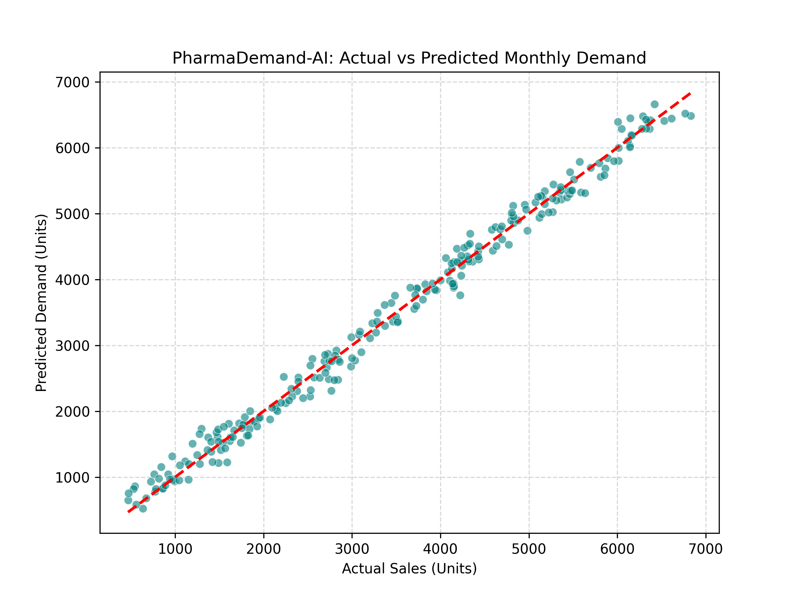
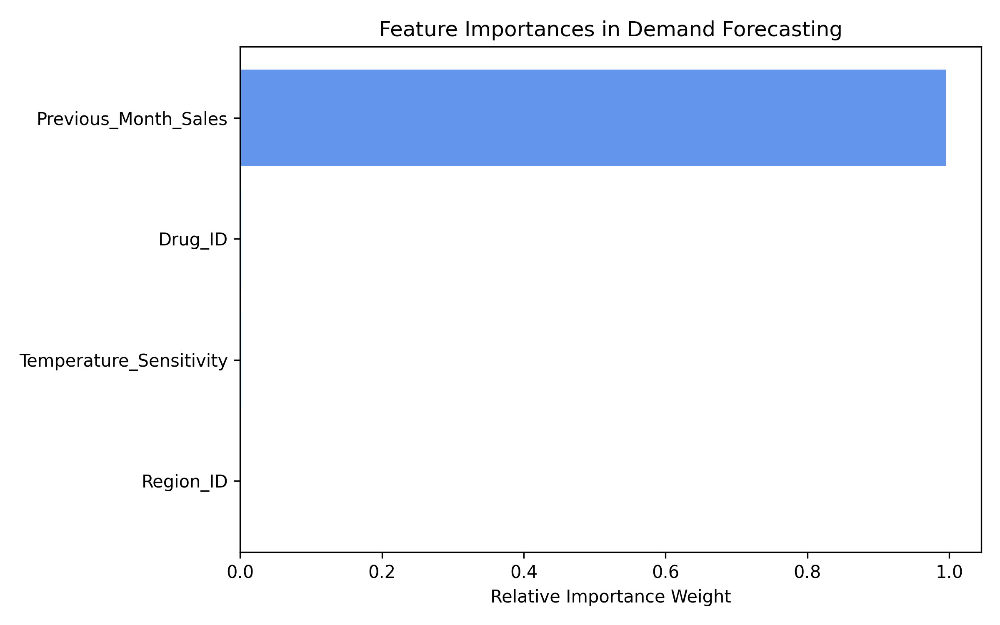

# PharmaDemand-AI: Predictive Inventory Optimization Pipeline

A robust Machine Learning-driven analytics pipeline engineered to forecast monthly drug distribution requirements across regional supply channels. This system addresses a critical problem space in the pharmaceutical industry: mitigating life-saving medication stockouts while minimizing overproduction and holding costs.

## 🚀 Key Features
* **Automated Data Preparation:** Real-time data structuring incorporating regional identifiers, drug classification metrics, and cold-chain temperature dependencies.
* **Predictive ML Core:** Utilizes an optimized Random Forest Regressor framework to interpret historical sales inertia and structural demand shifts.
* **Operational Telemetry:** Generates automated evaluation metrics and diagnostic visualizations to measure predictive confidence.

## 📊 Evaluation & Performance Metrics
The system automatically generates standard statistical benchmarks to measure performance accuracy:

* **Mean Absolute Error (MAE):** Measures average absolute deviation from actual quantities.
* **R-squared (R²) Score:** Quantifies the percentage of data variance explained by the model features (Target Performance: >95%).

---

## 🔍 Diagnostic Visual Proof

### 1. Model Accuracy: Actual vs. Predicted Demand
The plot below illustrates how closely the model's predictions align with actual demand data. A tight clustering around the diagonal reference line demonstrates a low error margin.

### 2. Feature Importance Metrics
This visual layout breaks down which operational variables weigh heaviest on the predictive pipeline's decisions. It validates that historical velocity serves as the core anchor.

---

## 🛠️ Tech Stack & Dependencies
* **Core Language:** Python 3.x
* **Data Engineering:** Pandas, NumPy
* **Machine Learning Library:** Scikit-Learn
* **Data Visualization:** Matplotlib, Seaborn

## 💻 How to Run the Pipeline
1. Clone this repository to your local directory.
2. Ensure you have dependencies installed: `pip install pandas numpy scikit-learn matplotlib seaborn`
3. Run the primary script: `python predictive_pipeline.py`
4. Review the generated performance profile in the console and locate visual exports inside the `/visualizations` directory.
